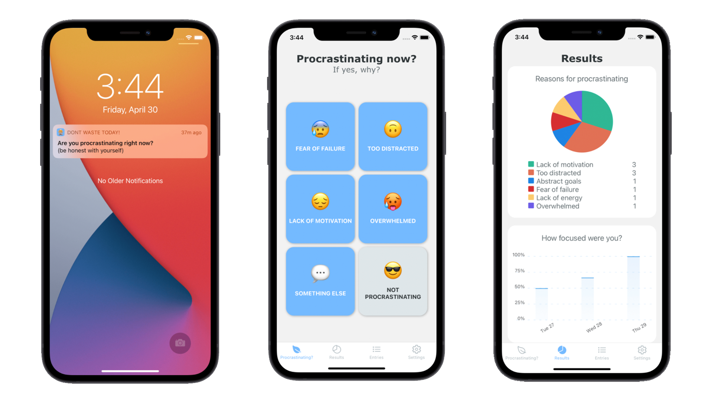

## Don't Waste Today!

### How it works
Don't Waste Today is a free and open source app that will:

- Help you understand how often you procrastinate
- Tell you why you procrastinate
- Give you the insights to take action to "unstuck" your life.

[See it in action!](https://dontwaste.today/)
## Technologies

- React Native 
- Redux, Redux Persist & Redux Thunk
- Firebase (App, Auth, Analytics, Crashlytics, Firestore, Functions, Remote-config)
- Eslint

## Most important Libraries

- [Google Sign In](https://github.com/react-native-google-signin/google-signin)
- [Sign In With Apple](https://github.com/invertase/react-native-apple-authentication)
- [Moment](https://momentjs.com/)
- [react-native-bootsplash](https://github.com/zoontek/react-native-bootsplash)
- [react-native-chart-kit](https://github.com/indiespirit/react-native-chart-kit)
- [react-native-push-notification](https://github.com/zo0r/react-native-push-notification)
- [@react-native-community/push-notification-ios](https://github.com/react-native-push-notification-ios/push-notification-ios)
- [react-native-simple-toast](https://github.com/vonovak/react-native-simple-toast)
- [react-navigation](https://github.com/react-navigation/react-navigation)

> Made with 💖 by the co-founders of [GoalsWon](https://www.goalswon.com/?utm_source=gh&utm_medium=sideproject&utm_campaign=dwt)
